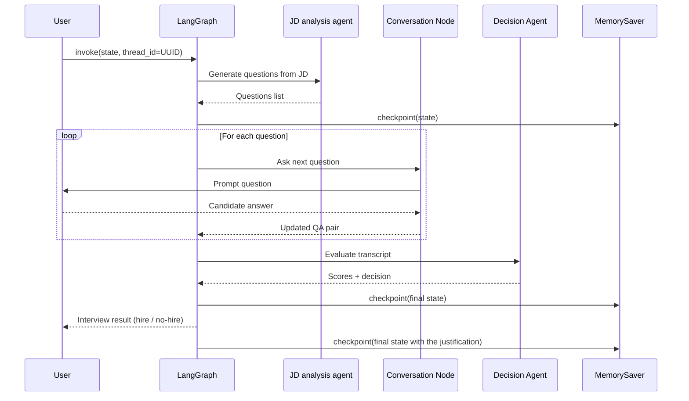

# Mock interview agent using Langchain

# Objective

This notebook uses agent workflows to analyze Job descriptions and generate potential interview questions. The candidate then types out responses, based on which the person's fit for the job is evaluated.

* The job description analysis also provides information on the role, field along with difficulty level of potential interview questions.
* For each question, the responses are graded on a scale of 1 to 10, with 1 being a poor /  no response and 10 being a perfect response
* The reason for providing the scores are also provided based on the expected answer rubric from the job description analysis
* Based on the above two, a recommendation is provided and justification for the same is given.

# System workflow


# Sample outputs:
## Cell output for sample interview for cloud engineering manager role:
```
Evaluation results: {
  "interview_questions": [
    {
      "question_id": "9966d6cd-e06c-4bc7-974f-5c3c5e927d27",
      "score": 9,
      "justification": "The candidate demonstrates a strong understanding of Azure Landing Zones by referencing the Cloud Adoption Framework and describing a multi-subscription environment. They cover key pillars such as identity management, resource organization, network topology with hub-and-spoke architecture, and governance via Azure Policy. The answer is detailed and aligns well with the expected answer, showing hands-on experience and awareness of scalability, security, and compliance. Minor deduction for not explicitly mentioning challenges faced."
    },
    {
      "question_id": "eb822f60-a267-4983-95d4-a9a21ff42d57",
      "score": 10,
      "justification": "The candidate provides a comprehensive approach to Infrastructure as Code, covering modular design, state management, security best practices, and integration with CI/CD pipelines. They mention version control, peer review, secret management with Azure Key Vault, and automated testing with tools like terratest. The explanation is thorough and matches the expected answer perfectly, demonstrating practical knowledge and best practices."
    },
    {
      "question_id": "4225e39a-2e7e-4f02-b2b3-675ebc9f8383",
      "score": 9,
      "justification": "The candidate effectively explains how they incorporated DevOps culture by promoting end-to-end ownership, blameless post-incident reviews, and shared responsibility. They describe standardizing CI/CD pipelines and making metrics visible to reinforce accountability. The answer aligns well with the expected response, showing both cultural and technical aspects of DevOps. Slight deduction for not explicitly mentioning continuous integration and automated testing in detail."
    },
    {
      "question_id": "ed4cb90d-f028-43e4-b6ed-117782ee9491",
      "score": 10,
      "justification": "The candidate provides a detailed and well-rounded approach to cloud security, emphasizing identity-first security with RBAC, managed identities, conditional access, MFA, and privileged access controls. They also describe a zero-trust network design with private endpoints, segmentation, and strict traffic control. Additionally, they mention continuous governance through Azure Policy, logging, and monitoring. This comprehensive answer fully meets the expectations for a hard-level question."
    },
    {
      "question_id": "7ffd7536-ef4a-4fc2-be50-1847b6e6e799",
      "score": 10,
      "justification": "The candidate uses the STAR method to clearly articulate a complex problem involving unexpected cloud cost spikes. They describe the situation, task, actions taken (automated tagging policy and scheduled shutdowns), and measurable results (22% cost reduction and cultural shift). This answer demonstrates strong problem-solving skills, practical implementation, and positive outcomes, fully satisfying the expected answer."
    },
    {
      "question_id": "c620fd22-77d6-4a89-be8c-7227a2b75a19",
      "score": 8,
      "justification": "The candidate explains a hybrid approach combining waterfall for upfront planning and agile for iterative delivery. They highlight planning foundational elements upfront to reduce risk and using agile for flexibility and incremental value. This shows a good understanding of both methodologies and their application in cloud projects. However, the answer could be improved by providing examples or more detail on how they adapt processes or decide between methodologies."
    }
  ],
  "decision": "hire",
  "reason": "The candidate consistently provides detailed, well-structured, and relevant answers across medium and hard difficulty questions, demonstrating strong technical knowledge and practical experience in cloud engineering concepts such as Azure Landing Zones, IaC, DevOps culture, cloud security, and problem-solving. Scores range from 8 to 10, indicating a high level of competency. The slight gaps do not detract from their overall suitability. Their responses reflect both strategic thinking and hands-on expertise, making them a strong fit for cloud engineering roles."
}
```

# Future upgrades
* Make this a mutli turn, conversational interview (instead of restricting to six questions). This includes:
    * Small talk: prompting the candidate to answer about themselves, their background, etc.
    * Incorporating follow-up / clarification questions to mimic real-life interviews
* Add evaluation and testing to the framework
* Incorporate multi-modal agents for the interview to capture audio and then evaluate